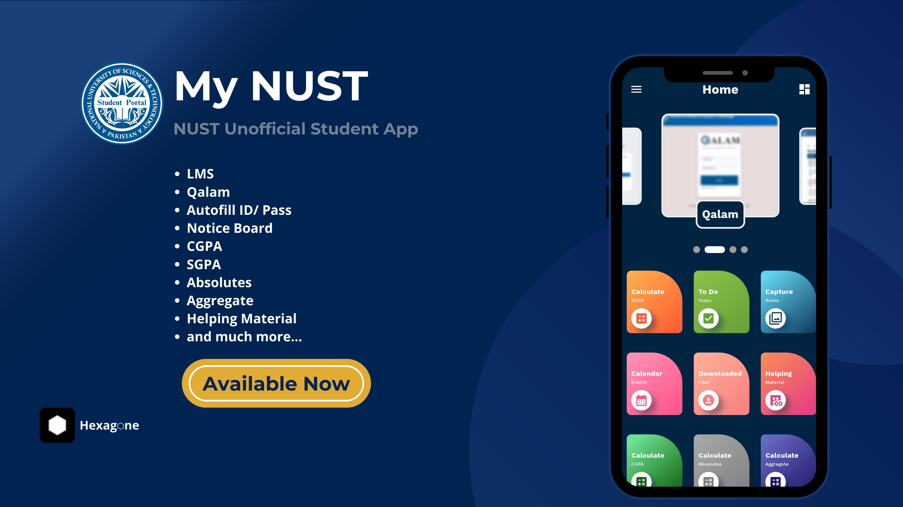

# My NUST - NUST Unofficial Student Portal

## Download Now: [My NUST on Playstore](https://play.google.com/store/apps/details?id=com.hexagone.mynust&pcampaignid=web_share)

## About:

'My NUST' is your ultimate companion for a seamless university experience. Designed exclusively for NUST students, this comprehensive app brings a range of features right to your fingertips, enhancing your academic journey and campus life like never before.

[Blog post](https://hexagone-apps.blogspot.com/2023/08/my-nust-nust-unofficial-student-portal.html)

Key Features:

1. Qalam Access: Stay informed about your academic progress with the NUST Qalam feature. Easily view your exam results and attendance records in real-time, allowing you to gauge your performance and make informed decisions.

2. LMS Access: Access course materials, lecture slides, and important announcements directly through the app's integrated NUST Learning Management System (LMS). Stay up-to-date with your studies effortlessly.

3. Autofill ID/Pass for LMS and Qalam: Enable autofill for a smoother login experience. No more hassles with login details. Update your app now and experience the convenience of seamless autofill for LMS and Qalam credentials.

4. Notice Board: Never miss a beat with the Notice Board feature. Get instant updates and announcements tailored to your specific sub-campus within NUST. Stay in the loop with campus events, deadlines, and important news.

5. GPA Calculator: Calculate your GPA accurately using the built-in GPA calculator. Stay on top of your grades and monitor your academic achievements effortlessly.

6. Absolutes and Aggregate: Plan your academic journey effectively by calculating absolutes and aggregates with ease especially for students preparing for NUST entry test . Make informed decisions about your course selections and future goals.

7. To-Do Tasks and Calendar: Keep track of your tasks and events with the app's intuitive To-Do and Calendar features. Stay organized and manage your time efficiently, ensuring a balanced academic and personal life.

8. Note Capture: Capture and save notes directly within the app. Whether it's a lecture summary, brainstorming session, or a creative idea, you can store and organize your notes hassle-free.

9. Helpful Links: Access a curated collection of helpful materials, references, and online resources that supplement your studies. Enhance your learning experience with easy access to valuable content.

'My NUST' is more than just an app – it's your personalized university companion, dedicated to streamlining your academic journey and enhancing your campus life. Download 'My NUST' now and unlock a world of convenience, organization, and empowerment."

## Privacy Policy: 

We take your privacy seriously. This app does not collect any personal data or information from its users. Any data you enter in the app, such as LMS / Qalam ID, Passwords, or your GPA, is stored locally on your device and not shared with any third parties.

By using this app, you agree to the following:
- All data you enter in the app is stored locally on your device and is not shared with any external servers. 
- We do not collect or store any personal information, including your name, email, or location.

For more details, please visit:
- [Privacy Policy](https://sites.google.com/view/mynust-privacy-policy/home)
- [Terms and Conditions](https://sites.google.com/view/mynust-terms-and-conditions/home)

## Request Source Code Method:

To request the source code of this project, please follow the guidelines mentioned in the repository's [Source Code Request Template](https://github.com/Hmmza-tariq/My-NUST-request-/issues/new/choose). We appreciate your interest in exploring and collaborating with our codebase!

## Screenshots:

|   |   |
|--------------|--------------|
| .png) | .png) |
| .png) | .png) |
| .png) | .png) |
